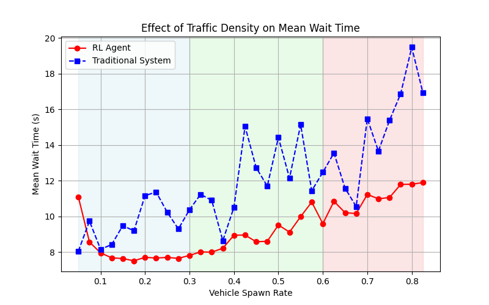
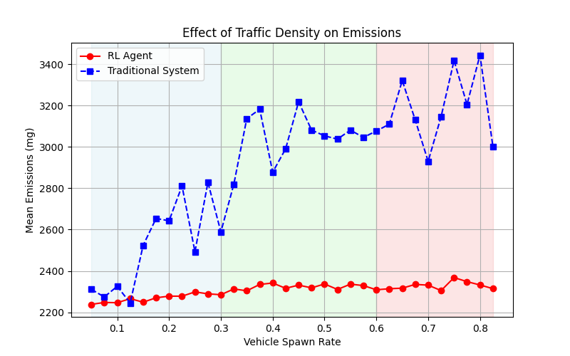

# TrafficLightRL: McMaster University

---

As McMaster students, we were curious how this project might be able to improve our own daily lives. Thus we trained and tested an RL agent on the Main St W and University Ave intersection, the results are as follows. In each of the graphs we evaluated the RL agent on varying traffic densities, with each point representing the average of 100 episodes to ensure statistical reliability and smooth distributions.

---

## 🎥 Demo Video (Green = Traditional System, Blue = RL Agent)

---

## 🖼️ Simulation vs. Reality
Our network was generated from OpenStreetMap data. While pedestrian crosswalks were omitted due to export limitations, this does not impact the core RL functionality.

---

## 🚦 Results

📉 Wait Time Reduction:
- Low Traffic: 13% decrease
- Medium Traffic: 24% decrease
- High Traffic: 19% decrease

🌱 Emissions Reduction:
- Low Traffic: 10% decrease
- Medium Traffic: 23% decrease
- High Traffic: 29% decrease

---

🚀 Future Enhancements

- Emergency Vehicle Priority: Optimize signals for ambulances near McMaster Children's Hospital.
- Pedestrian Consideration: Improve network accuracy by integrating pedestrian crossings.
- Expanded Deployment: Apply the model to additional real-world locations.

Our results demonstrate RL’s potential to revolutionize trffic management—making within the McMaster Community. Implementation of this project would make roads safer, more efficient, and environmentally friendly for Students, McMaster Faculty, and members of the community.
