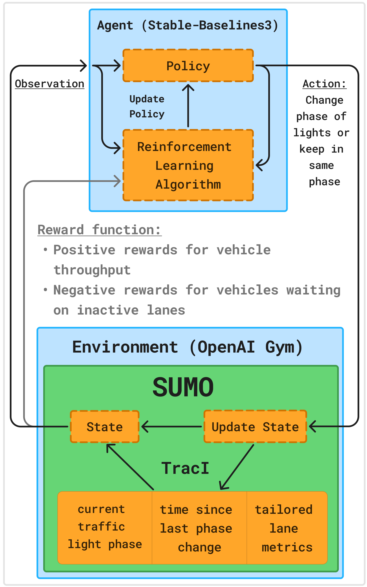

# 🚦 TrafficLightRL: README

---

## 🌟 Project Overview

**TrafficLightRL** leverages **Reinforcement Learning (RL)** to dynamically optimize traffic light control systems, reducing urban congestion and improving travel efficiency. By integrating real-world mapping tools with deep RL models, we develop adaptive signal control strategies that improve traffic flow, reduce emissions, and enhance urban mobility.

---

## 👥 Team Contributions

Our project applies **OpenStreetMap's Web Wizard** to export real-life geographical locations and train RL agents on real-world traffic data. By targeting intersections in major university campuses, we demonstrate **TrafficLightRL’s** ability to optimize traffic flow in practical, high-traffic areas. Each contributor focused on specific campus intersections, refining reward functions and agent performance for optimal real-world traffic simulations.

- **Kristian Diana** - Project Lead ([McMaster University](McMaster/))  
- **Clara Wong** - Project Member ([University of Waterloo](Waterloo/))  
- **Ryan Li** - Project Member ([Queen’s University](Queens/))  
- **Varun Pathak** - Project Member ([University of Toronto](UofT/))  
- **Tridib Banik** - Project Member ([Western University](Western/))  

---

## 🎯 Objectives & Key Features

- **Smart Traffic Control:** Adaptive traffic light decisions powered by RL agents.
- **Real-World Simulations:** Authentic intersection models using **SUMO** and **OpenStreetMap**.
- **Custom Reward Functions:** Tailored metrics to balance traffic flow and safety.
- **Comprehensive Visualizations:** Progress tracking with SUMO-GUI simulations.

---

## 🔄 Process Flow

### How It Works  
Our RL agent observes the current traffic state using SUMO simulation data. Based on predefined reward functions, it adjusts signal timing to minimize congestion and improve efficiency. Over multiple training episodes, the agent optimizes its policy for real-world intersections.

  

<em>Process Flow Diagram</em>

---

## 📄 Learn More

For an in-depth breakdown of **TrafficLightRL**, check out:  

- 📄 [Research Paper](./Documentation/TrafficLightRL_Research_Paper_2025.pdf) - Explains project motivation, RL methodology, and experimental results.  
- 📑 [Design Document](https://docs.google.com/document/d/1m9ZCDl1O3ZabAaP11Tbe45Mk0o_FngD5ALsPjLbx118/edit?tab=t.0#heading=h.vtvp6977md3z) - Project timeline, technical decisions, and key insights.  

---

## 📚 Referenced Technologies

- [Stable-Baselines3 Documentation](https://stable-baselines3.readthedocs.io/en/master/)
- [SUMO (Simulation of Urban MObility)](https://www.eclipse.org/sumo/)
- [OpenStreetMap](https://www.openstreetmap.org/)
- [OpenAI Gymnasium](https://gymnasium.farama.org/)
