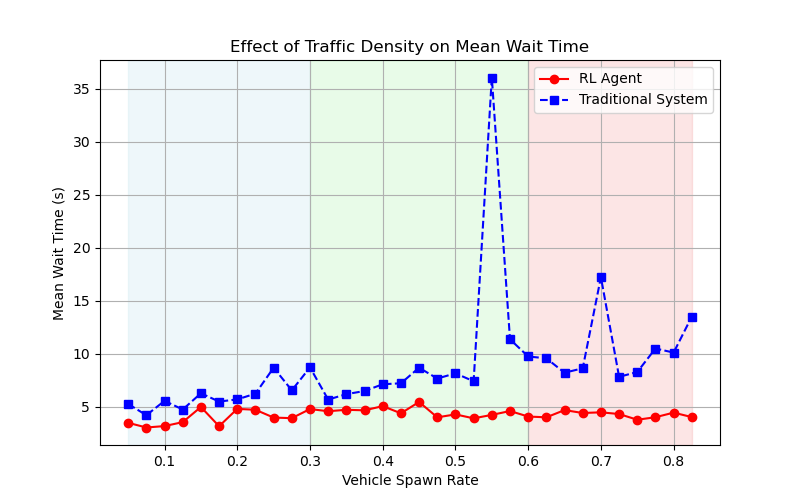
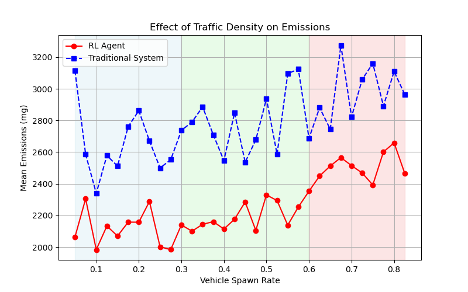

# TrafficLightRL: University of Toronto

---

As McMaster students, we were curious how this project might be able to improve our own daily lives. Thus we trained and tested an RL agent Toronto's own, Queen's Park intersection (College St. & University Ave.), the results are as follows. In each of the graphs we evaluated the RL agent on varying traffic densities, with each point representing the average of 100 episodes to ensure statistical reliability and smooth distributions.

---

## 🎥 Demo Video (Green = Traditional System, Blue = RL Agent)

---

## 🖼️ Simulation vs. Reality
Our network was generated from OpenStreetMap data. While pedestrian crosswalks and streetcars were omitted due to export limitations, this does not impact the core RL functionality.

---

## 🚦 Results

📉 Wait Time Reduction:
- Low Traffic: 47.1% decrease
- Medium Traffic: 41.6% decrease
- High Traffic: 70.4% decrease

🌱 Emissions Reduction:
- Low Traffic: 24.2% decrease
- Medium Traffic: 30.2% decrease
- High Traffic: 24.8% decrease

---

## 🚀 Future Enhancements

- Implement TTC Priority Signals: The model will detect approaching streetcars and buses to adjust signal timing dynamically, minimizing delays for public transit users.
- Pedestrian Consideration: Improve network accuracy by integrating pedestrian crossings.
- Expand the RL model to multiple intersections in downtown Toronto, integrating it with the city's smart traffic management system.

Our results demonstrate RL’s potential to revolutionize traffic management—making within communities across the GTA. Implementation of this project would make roads safer, more efficient, and environmentally friendly for Students at the University of Toronto, and members of the community.
