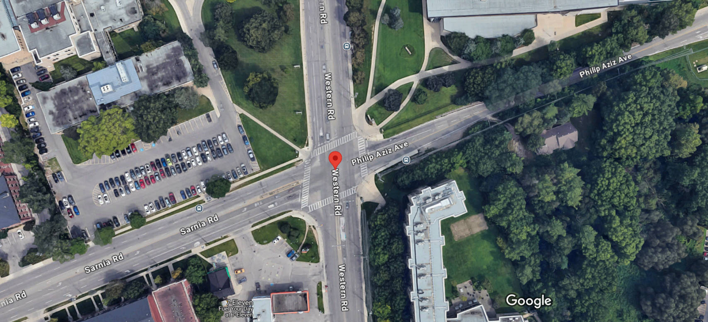
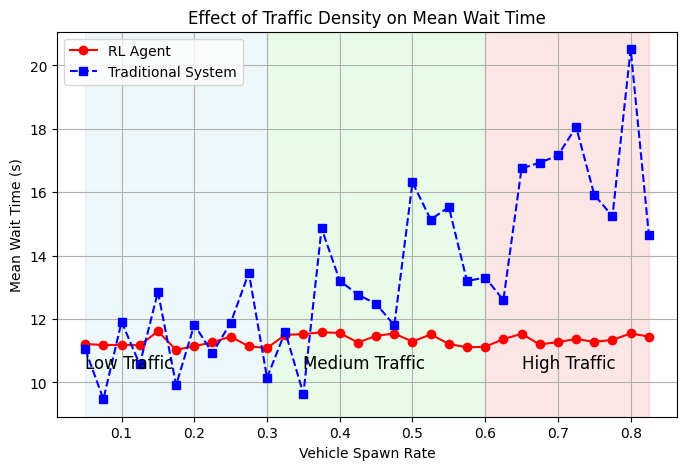
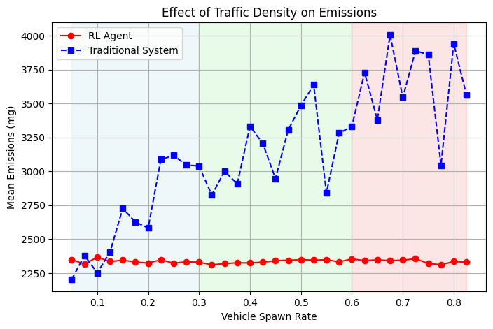

# TrafficLightRL: Western University

---

## 🚦 Brief Description
TrafficLightRL is a project dedicated to optimizing traffic light control systems using reinforcement learning (RL). The Western University branch of the project focuses on the intersection of Sarnia Rd & Philip Aziz Ave, near Western University in London, ON. By integrating advanced machine learning techniques with real-world urban infrastructure data, the project aims to enhance traffic flow and reduce congestion.

The evaluation process involves testing the RL agent across various traffic densities. Each data point in the presented graphs represents the average performance over 100 episodes, ensuring statistical reliability and smooth distributions.

---

## 🎥 Demo Video (Green = Traditional System, Blue = RL Agent)

---

## 🖼️ Simulation vs. Reality
The network for this geographical location was generated using OpenStreetMap data and exported to a SUMO network via the OSM Web Wizard. Although pedestrian crosswalks were omitted due to export limitations, this omission does not affect the core functionality of the RL system.

---

## 🚦 Results

## 📉 Wait Time Reduction

| Traffic Level | RL Agent (seconds) | Traditional System (seconds) | Reduction (%) |
|---------------|--------------------|------------------------------|---------------|
| Low Traffic   | 11.239839990289614 | 11.38728616161616            | 1.32%         |
| Medium Traffic| 11.388258329902675 | 13.057499999999997           | 12.79%        |
| High Traffic  | 11.349240299271518 | 16.113999999999997           | 29.55%        |

## 🌱 Emissions Reduction

| Traffic Level | RL Agent (mg)           | Traditional System (mg)      | Reduction (%) |
|---------------|-------------------------|------------------------------|---------------|
| Low Traffic   | 2337.890624050132       | 2643.0399574156813           | 11.55%        |
| Medium Traffic| 2334.025230045951       | 3151.6486264464766           | 25.94%        |
| High Traffic  | 2338.928777323909       | 3629.7550874920466           | 35.56%        |

---

## 🚀 Future Enhancements

- Pedestrian Consideration and Bus Stops: Improve network accuracy by integrating pedestrian crossings and existing bus stops.
- Expanded Deployment: Apply the model to additional real-world locations.

---

## 📌 Conclusion

The results demonstrate the potential of RL to revolutionize traffic management within the Western community. Implementing this project would create safer, more efficient, and environmentally friendly roads for students, faculty, and community members.
