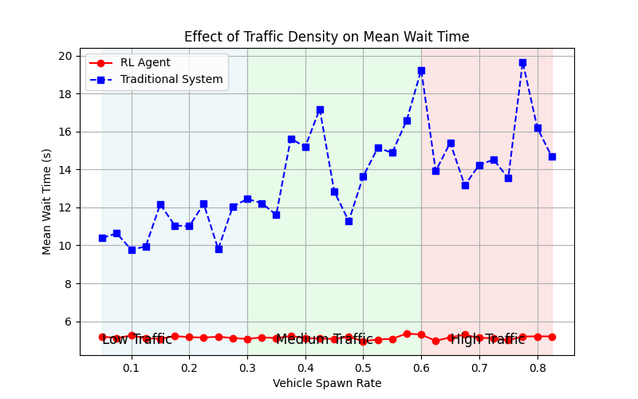
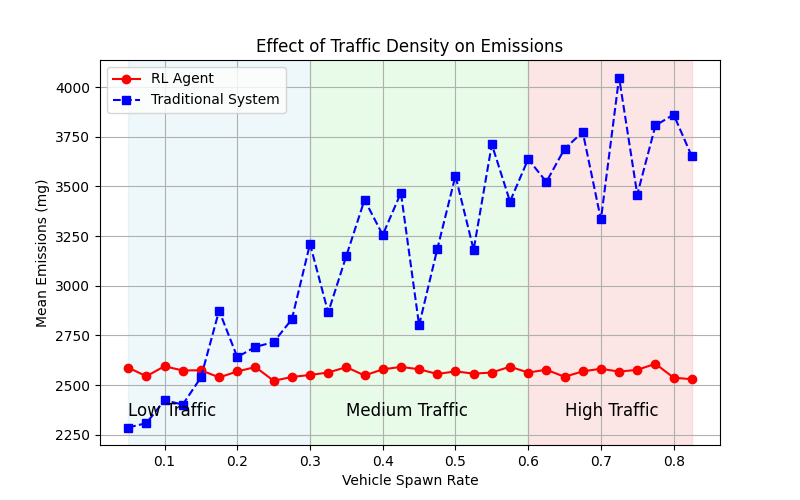

# TrafficLightRL: Western University

---

## 🚦 Brief Description
TrafficLightRL is a project dedicated to optimizing traffic light control systems using reinforcement learning (RL). The Western University branch of the project focuses on the intersection of Sarnia Rd & Philip Aziz Ave, near Western University in London, ON. By integrating advanced machine learning techniques with real-world urban infrastructure data, the project aims to enhance traffic flow and reduce congestion.

The evaluation process involves testing the RL agent across various traffic densities. Each data point in the presented graphs represents the average performance over 100 episodes, ensuring statistical reliability and smooth distributions.

---

## 🎥 Demo Video (Green = Traditional System, Blue = RL Agent)

---

## 🖼️ Simulation vs. Reality
The network for this geographical location was generated using OpenStreetMap data and exported to a SUMO network via the OSM Web Wizard. Although pedestrian crosswalks were omitted due to export limitations, this omission does not affect the core functionality of the RL system.

---

## 🚦 Results

📉 Wait Time Reduction:
- Low Traffic: 52.75% decrease (5.153439999999999 seconds for RL agent vs 10.900629494949495 seconds for traditional system)
- Medium Traffic: 63.58% decrease (5.11545 seconds for RL agent vs 14.059166666666668 seconds for traditional system)
- High Traffic: 66.69% decrease (5.15061 seconds for RL agent vs 15.463 seconds for traditional system)

🌱 Emissions Reduction:
- Low Traffic: 0.30% decrease (2563.4278605333284 mg for RL agent vs 2571.2184771453694 mg for traditional system)
- Medium Traffic: 21.41% decrease (2569.968846555399 mg for RL agent vs 3269.955435111211 mg for traditional system)
- High Traffic: 30.27% decrease (2565.0124662914504 mg for RL agent vs 3678.6634837045954 mg for traditional system)

---

🚀 Future Enhancements

- Pedestrian Consideration and Bus Stops: Improve network accuracy by integrating pedestrian crossings and existing bus stops.
- Expanded Deployment: Apply the model to additional real-world locations.

The results demonstrate the potential of RL to revolutionize traffic management within the Western community. Implementing this project would create safer, more efficient, and environmentally friendly roads for students, faculty, and community members.
